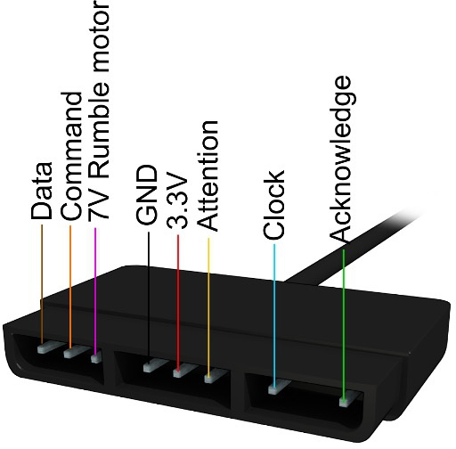

#   Pinouts
#### External Connectors
[Pinouts - Controller Ports and Memory-Card Ports](#pinouts---controller-ports-and-memory-card-ports)<br/>
[Pinouts - Audio, Video, Power, Expansion Ports](#pinouts---audio-video-power-expansion-ports)<br/>
[Pinouts - SIO Pinouts](#pinouts---sio-pinouts)<br/>

#### Internal Pinouts
[Pinouts - Chipset Summary](#pinouts---chipset-summary)<br/>
[Pinouts - CPU Pinouts](../pinouts-internal/SKILL.md#pinouts---cpu-pinouts)<br/>
[Pinouts - GPU Pinouts (for old 160-pin GPU)](../pinouts-internal/SKILL.md#pinouts---gpu-pinouts-for-old-160-pin-gpu)<br/>
[Pinouts - GPU Pinouts (for new 208-pin GPU)](../pinouts-internal/SKILL.md#pinouts---gpu-pinouts-for-new-208-pin-gpu)<br/>
[Pinouts - SPU Pinouts](../pinouts-internal/SKILL.md#pinouts---spu-pinouts)<br/>
[Pinouts - DRV Pinouts](../pinouts-internal/SKILL.md#pinouts---drv-pinouts)<br/>
[Pinouts - VCD Pinouts](../pinouts-internal/SKILL.md#pinouts---vcd-pinouts)<br/>
[Pinouts - HC05 Pinouts](../pinouts-internal/SKILL.md#pinouts---hc05-pinouts)<br/>
[Pinouts - MEM Pinouts](../pinouts-internal/SKILL.md#pinouts---mem-pinouts)<br/>
[Pinouts - CLK Pinouts](../pinouts-internal/SKILL.md#pinouts---clk-pinouts)<br/>
[Pinouts - PWR Pinouts](../pinouts-internal/SKILL.md#pinouts---pwr-pinouts)<br/>
[Pinouts - Component List and Chipset Pin-Outs for Digital Joypad, SCPH-1080](../pinouts-internal/SKILL.md#pinouts---component-list-and-chipset-pin-outs-for-digital-joypad-scph-1080)<br/>
[Pinouts - Component List and Chipset Pin-Outs for Analog Joypad, SCPH-1150](../pinouts-internal/SKILL.md#pinouts---component-list-and-chipset-pin-outs-for-analog-joypad-scph-1150)<br/>
[Pinouts - Component List and Chipset Pin-Outs for Analog Joypad, SCPH-1200](../pinouts-internal/SKILL.md#pinouts---component-list-and-chipset-pin-outs-for-analog-joypad-scph-1200)<br/>
[Pinouts - Component List and Chipset Pin-Outs for Analog Joypad, SCPH-110](../pinouts-internal/SKILL.md#pinouts---component-list-and-chipset-pin-outs-for-analog-joypad-scph-110)<br/>
[Pinouts - Component List and Chipset Pin-Outs for Namco Lightgun, NPC-103](../pinouts-internal/SKILL.md#pinouts---component-list-and-chipset-pin-outs-for-namco-lightgun-npc-103)<br/>
[Pinouts - Component List and Chipset Pin-Outs for Multitap, SCPH-1070](../pinouts-internal/SKILL.md#pinouts---component-list-and-chipset-pin-outs-for-multitap-scph-1070)<br/>
[Pinouts - Memory Cards](../pinouts-internal/SKILL.md#pinouts---memory-cards)<br/>

#### Mods/Upgrades
[Mods - Nocash PSX-XBOO Upload](../pinouts-internal/SKILL.md#mods---nocash-psx-xboo-upload)<br/>
[Mods - PAL/NTSC Color Mods](../pinouts-internal/SKILL.md#mods---palntsc-color-mods)<br/>


##   Pinouts - Controller Ports and Memory-Card Ports
#### Controller Ports and Memory-Card Ports


```
                   _______________________
Memory card slot: | 9 7 6 | 5 4 3 |  2 1  |
                  |_=_=_=_|_=_=_=_|__=_=__|
                   _______________________
                  | 9 8 7 | 6 5 4 | 3 2 1 |
Controller port:  | * * * | * * * | * * * |
                  '\______|_______|______/'
```

| Pin | Dir | Name         | SIO0 pin | Description                    |
| --: | :-- | :----------- | :------- | :----------------------------- |
|   1 | In  | `DAT`/`MISO` | `RX`     | Serial data from device        |
|   2 | Out | `CMD`/`MOSI` | `TX`     | Serial data to device          |
|   3 |     | `+7.5V`      |          | Supply for rumble motors       |
|   4 |     | `GND`        |          | Ground                         |
|   5 |     | `+3.5V`      |          | Supply for main logic          |
|   6 | Out | `/CSn`       | `DTRn`   | Port select                    |
|   7 | Out | `SCK`        | `SCK`    | Serial data clock              |
|   8 | In  | `/IRQ`       | `/IRQ10` | Lightgun IRQ (controller only) |
|   9 | In  | `/ACK`       | `DSR`    | Data acknowledge IRQ           |

/CSn are two separate signals (/CS1 for controller/memory card port 1, /CS2 for
port 2). All other signals are exactly the same on all four connectors (with the
memory card slots lacking the /IRQ pin and shield).<br/>

#### /IRQ pin
Most or all controllers leave pin 8 unused, the pin can be used as lightpen
input (not sure if the CPU is automatically latching a timer somewhere?), if
there's no auto-latched timer, then the interrupt would be required to be
handled as soon as possible; ie. don't disable interrupts, and don't "halt" the
CPU for longer periods (as far as I understood, the GTE can halt the CPU when
trying to read results of incomplete operations; to avoid that, one could wait
by software, eg. inserting NOPs, before reading GTE results...?)<br/>
(Some (or maybe all?) existing psx lightguns are reportedly connected to the
Video output on the Multiout port for determining the current cathode ray
position though).<br/>


##   Pinouts - Audio, Video, Power, Expansion Ports
#### AV Multi Out (Audio/Video Port)
```
  1      RGB-Video Green
  2      RGB-Video Red
  3      Supply +5.0V (eg. supply for external RF adaptor)
  4      RGB-Video Blue
  5      Supply Ground
  6      S-Video C (chrominance)
  7      Composite Video (yellow cinch)
  8      S-Video Y (luminance)                    ____________________________
  9      Audio Left      (white cinch)           |                            |
  10     Audio Left Ground                       | 12 11 10 9 8 7 6 5 4 3 2 1 |
  11     Audio Right     (red cinch)             |____________________________|
  12     Audio Right Ground
  Shield Video Ground
```
The standard AV-cable connects only to Pins 7,9,10,11,12,Shield (with pin 1 and
3 and Shield shortcut with each other, used for both audio and video ground).<br/>
The plug on that cable does have additional sparings for pin 1,3,5 (though
without any metal-contacts installed in there) (pin 3,5 would be used as supply
for external RF modulators) (no idea what pin 1 could be used for though?).<br/>
RGB displays may (or may not) be able to extract /SYNC from the Composite
signal, if that doesn't work, note that /SYNC (and separate /VSYNC, /HSYNC
signals) are found on the GPU pinouts, moreover, the GPU outputs 24bit digital
RGB.<br/>
Not sure if a VGA monitor can be connected? The SYNC signals are there (see GPU
pinputs), but the vertical resolution is only 200/240 lines... standard VGA
displays probably support only 400/480 lines (or higher resolutions for newer
multisync SVGA displays) (as far as I know, the classic 200 lines VGA mode is
actually outputting 400 lines, with each line repeated twice).<br/>

#### Parallel Port (PIO) (Expansion Port) (CN103)
This port exists only on older PSX boards (not on newer PSX boards, and not on
PSone boards).<br/>
The parallel port is used by various third-party unlicensed cheat cartridges and
VCD player addons, as well as by the PSIO optical drive emulator (see below).<br/>
```
             ________
            |        |                            Console Rear View
      GND ==| 1   35 |== GND                 .-------------------------.
   /RESET  =| 2   36 |=  DACK5               |1  2  3  ... ... 32 33 34|
    DREQ5  =| 3   37 |=  /IRQ10              |35 36 37 ... ... 66 67 68|
     /CS0  =| 4   38 |=  /WR1                |__.-------------------.__|
(SBEN)GND  =| 5   39 |=  GND(CS2)
       D0  =| 6   40 |=  D1
       D2  =| 7   41 |=  D3
       D4  =| 8   42 |=  D5
       D6  =| 9   43 |=  D7
       D8  =|10   44 |=  D9
      D10  =|11   45 |=  D11
      D12  =|12   46 |=  D13
      D14  =|13   47 |=  D15
       A0  =|14   48 |=  A1
       A2  =|15   49 |=  A3
      GND  =|16   50 |=  GND
    +3.5V ==|17   51 |== +3.5V
    +7.5V ==|18   52 |== +7.5V
      GND  =|19   53 |=  GND
       A4  =|20   54 |=  A5
       A6  =|21   55 |=  A7
       A8  =|22   56 |=  A9
      A10  =|23   57 |=  A11
      A12  =|24   58 |=  A13
      A14  =|25   59 |=  A15
      A16  =|26   60 |=  A17
      A18  =|27   61 |=  A19
      A20  =|28   62 |=  A21
      A22  =|29   63 |=  A23
      /RD  =|30   64 |=  /WR0
(/IRQ2)NC  =|31   65 |=  NC(/CS5)
    SYSCK  =|32   66 |=  LRCK
     BCLK  =|33   67 |=  SDIN
      GND ==|34   68 |== GND
            |________|
```
On a stock console, pin 5 is ground and pins 31 and 65 are not connected. These
pins are repurposed by the PSIO's switch board to allow the PSIO to emulate the
CD-ROM drive; when pin 5 (SBEN) is high, the switch board disconnects the CPU's
/CS5 and /IRQ2 pins from the CD drive and routes them to pins 65 and 31
respectively, allowing the PSIO to take over. Pin 39 can also be repurposed in a
similar way to allow /CS2 and thus the internal BIOS ROM to be overridden.<br/>
For more details see:<br/>
[pcsx-redux - PIO port](https://github.com/grumpycoders/pcsx-redux/wiki/PIO-port)<br/>
[pcsx-redux - Switch Board](https://github.com/grumpycoders/pcsx-redux/wiki/Switch-Board)<br/>

#### Internal Power Supply (PSX)
The PSX contains an internal power supply, however, like the PSone, it's only
having a "Standby" button, which merely disconnects 3.5V and 7.9V from the
mainboard. The actual power supply remains powered, and wastes energy day and
night, thanks Sony!<br/>

#### External Power Supply (PSone)
```
  Inner +7.5V DC 2.0A   (inside diameter 0.8mm)
  Outer GND             (outside diameter 5.0mm)
```


##   Pinouts - SIO Pinouts
#### Serial Port
That port exists only on original Playstation (not on the PSone). The shape of
the Serial Port is identical to the 12pin Multiout (audio/video) port, but with
only 8pins.<br/>
```
  1 SIO1 In  RXD receive data    (from remote TXD)
  2 SIO2 -   VCC +3.5VDC         (supply, eg. for voltage conversion)
  3 SIO3 In  DSR                 (from remote DTR)           _________________
  4 SIO4 Out TXD transmit data   (to remote RXD)            |                 |
  5 SIO5 In  CTS clear to send   (from remote RTS)          | 8 7 6 5 4 3 2 1 |
  6 SIO6 Out DTR                 (to remote DSR)            |_________________|
  7 SIO7 -   GND Ground          (supply, eg. for voltage conversion)
  8 SIO8 Out RTS request to send (to remote CTS)
  Shield     GND Ground          (to/from remote GND)
```
Can be used to communicate with another PSX via simple cable connection. With
an external RS232 adaptor (for voltage conversion) it could be also used to
communicate with a PC, a mouse, a modem, etc.<br/>

#### PSone Serial Port
The PSone doesn't have an external serial connector, however, easy to use
soldering points for serial port signals are found as cluster of 5 soldering
points (below CPU pin52), and a single soldering point (below CPU pin100),
arranged like so (on PM-41 boards) (might be different on PM-41(2) boards):<br/>
```
                     CPU70.RTS
               CPU71.CTS   CPU74.TxD
                     CPU72.DTR   CPU75.RxD                       CPU73.DSR
```
The three outputs (RTS,DTR,TXD) are left floating, the RXD input is wired via a
1K ohm pull-up resistor to 3.5V, the other two inputs (CTS,DSR) are wired via
1K ohm pull-down resistors to GND.<br/>
If you want to upgrade the PSone, remove that resistors, and then install the
PSX-style serial circuit (as shown below), or, think of a more simplified
circuit without (dis-)inverted signals.<br/>

#### PSX Serial Port Connection (PU-23 board) (missing on PM-41 board)
The PSX serial circuit basically consists of a few transistors, diodes, and
resistors. The relevant part is that most of the signals are inverted -
compared with RS232 signals, the CPU uses normal high/low levels (of course
with 0V and 3.5V levels, not -12V and +12V), and the signals at the serial port
socket are inverted. Ie. if you want to built a RS232 adaptor, you must either
externally undo the inversion, or, disconnect the transistors, and wire your
circuit directly to the CPU signals.<br/>
```
  SIO8    SIO6    SIO4    SIO1    SIO3    SIO5    SIO2    SIO7---GND
    |       |       |       |       |       |      |
  FB112   FB114   FB116   FB115   FBnnn   FBnnn    o--L102-------3.5V
    |       |       |       |       |       |
    |       |       o-------|-------|-------|--------diode-------GND
    |       |       |       o-------|-------|--------diode-------GND
    |       |       |       |       o-------|--------diode-------GND
    |       |       |       |       |       o--------diode-------GND
    |       |       |       |       |       |
    |       |       |       o-------|-------|--------[1K]--------3.5V
    |       |       |       |       o-------|--------[1K]--------3.5V
   [22]    [22]    [22]    [22]     |       o--------[1K]--------3.5V
    |       |       |       |       |       |
   Q105-----|-------|-------|-------|-------|--------------------GND
    |      Q105-----|-------|-------|-------|--------------------GND
    |       |       |       |      Q106-----|--------------------GND
    |       |       |       |       |      Q106------------------GND
    |       |       |       |       |       |
    |       |       |       |       o-------|--------[470]-------3.5V
    |       |       |       |       |       o--------[470]-------3.5V
    |       |       |       |       |       |
   RTS     DTR     TxD     RxD     DSR     CTS
  CPU70   CPU72   CPU74   CPU75   CPU73   CPU71   <-- CPU Pin Numbers
   out     out     out     in      in      in
```
All six signals are passed through fuses (or loops or so). The three inputs
have 1K ohm pull-ups, and diodes as protection against negative voltages, two
of the inputs are inverted via transistors, with 470 ohm pull-ups at the CPU
side, the other input is passed through 22 ohm to the CPU. The three outputs
are also passed through 22 ohm, one of them having a diode as negative voltage
protection, the other two are inverted via transistors (which may also serve as
negative voltage protection).<br/>
Note that there is no positive voltage protection (ie. +12V inputs would do no
good, also strong -12V inputs might overheat the diodes/fuses, so if you want
to use RS232 voltages, better use a circuit for voltage conversion).<br/>

#### Serial RS232 Adaptor
The PSX serial port uses 0V/3.5V logic, whilst RS232 uses -5V/+5V...-15V/+15V
logic. An example circuit for converting the logic levels would be:<br/>
```
    PSX.VCC--+||--PSX.GND  PSX.GND----DSUB.5.GND----DSUB.SHIELD  DSUB.1,9----NC
                   ______                                 ______
  ,-----------||+-|1   16|-------PSX.VCC ,-----------||+-|1   16|-------PSX.VCC
  | PSX.GND---||+-|2   15|-------PSX.GND | PSX.GND---||+-|2   15|-------PSX.GND
  '---------------|3   14|----DSUB.3.TXD '---------------|3   14|--- N/A
         ,---+||--|4   13|----DSUB.2.RXD        ,---+||--|4   13|--- N/A
         '--------|5   12|-------PSX.RXD        '--------|5   12|--- N/A
    PSX.GND--+||--|6   11|-------PSX.TXD   PSX.GND--+||--|6   11|--- N/A
    DSUB.7.RTS----|7   10|--o<|--PSX.RTS   DSUB.4.DTR----|7   10|--o<|--PSX.DTR
    DSUB.8.CTS----|8    9|--|>o--PSX.CTS   DSUB.6.DSR----|8    9|--|>o--PSX.DSR
                  |______|                               |______|
```
Parts List: 1 or 2 MAX232 chips (voltage conversion), 0 or 1 7400 (NAND, used
as inverter), 4 or 8 1uF/16V capacitors, 1x 10uF/16V capacitor, 1x 9pin male
SubD plug.<br/>
The four inverters are needed only for external adapters (which need to undo
the transistor inversion on the PSX mainboard) (ie. the inverters are not
needed when when connecting the circuit directly to the PSX CPU).<br/>
The second MAX232 chip is needed only if DTR/DSR "not ready" conditions are
required (for an "always ready" condition: DSUB.4.DTR can be wired to -8.5V,
which is available at Pin6 of the first MAX232 chip, and PSX.DSR can be wired
to +3.5V).<br/>
With the above DSUB pin numbers, peripherals like mice or modems can be
connected directly to the circuit. For connection to another computer, use a
"null modem" cable (with crossed RXD/TXD, RTS/CTS, DTR/DSR wires).<br/>
The circuit works with both VCC=5V (default for MAX232) and with VCC=3.5V
(resulting in slightly weaker signals, but still strong enough even for serial
mice; which are mis-using the RS232 signals as power supply).<br/>


##   Pinouts - Chipset Summary
#### PSX/PSone Mainboards
```
  Board    Expl.
  PU-7     PSX, with AV multiout+cinch+svideo, GPU in two chips (160+64pins)
  PU-8     PSX, with AV multiout+cinch, four 8bit Main RAM chips
            EARLY-PU-8: "PU-8 1-658-467-11, N4" --> old chipset, resembles PU-7
            LATE-PU-8:  "PU-8 1-658-467-22, N6" --> new chipset, other as PU-7
  PU-9     PSX, without SCPH-number (just sticker saying "NOT FOR SALE, SONY)
  PU-16    PSX, with extra Video CD daughterboard (for SCPH-5903)
  PU-18    PSX, with AV multiout only, single 32bit Main RAM (instead 4x8bit)
  PU-20    PSX, unknown if/how it differs from PU-18
  PU-22    PSX, unknown if/how it differs from PU-18
  PU-23    PSX, with serial port, but without expansion port
  PM-41    PSone, older PSone, for GPU/SPU with RAM on-board (see revisions)
  PM-41(2) PSone, newer PSone, for GPU/SPU with RAM on-chip
```
There are at least two revisions of the "PM-41" board:<br/>
```
  PM-41, 1-679-335-21  PSone with incomplete RGB signals on multiout port
  PM-41, 1-679-335-51  PSone with complete RGB signals on multiout port
```
The "incomplete" board reportedly requires to solder one wire to the multiout
port to make it fully functional... though no idea which wire... looks like the
+5V supply? Also, the capacitors near multiout are arranged slightly
differently.<br/>
The PM-41 board absorbed its external RAM across sub-revisions: -11..-51 use an
external VRAM chip + external SPU-RAM chip (CXD8561 GPU + CXD2938Q SPU/CDROM);
-61 switches to the CXD9500Q GPU with on-chip VRAM (but keeps the external
SPU-RAM + CXD2938Q); only -71 ("PM-41(2)") adds the CXD2941R with on-chip
SPU-RAM. So GPU-RAM was integrated one sub-revision before SPU-RAM.<br/>

#### CPU chips
```
  IC103 - 208pin - "SONY CXD8530BQ"  ;seen on PU-7 board
  IC103 - 208pin - "SONY CXD8530CQ"  ;seen on PU-7 and PU-8 boards
  IC103 - 208pin - "SONY CXD8606Q"   ;seen in PU-18 schematic
  IC103 - 208pin - "SONY CXD8606AQ"  ;seen on PU-xx? board
  IC103 - 208pin - "SONY CXD8606BQ"  ;seen on PM-41, PU-23, PU-20 boards
  IC103 - 208pin - "SONY CXD8606CQ"  ;seen on PM-41 board, too
```
These chips contain the MIPS CPU, COP0, and COP2 (aka GTE), MDEC and DMA.<br/>

#### GPU chips - Graphics Processing Unit
```
  IC203 - 160pin - "SONY CXD8514Q"   ;seen on PU-7 and EARLY-PU-8 boards
  IC203 - 208pin - "SONY CXD8561Q"   ;seen on LATE-PU-8 board
  IC203 - 208pin - "SONY CXD8561BQ"  ;seen on PU-18, PU-20 boards
  IC203 - 208pin - "SONY CXD8561CQ"  ;seen on PM-41 board
  IC203 - 208pin - "SONY CXD9500Q"   ;with on-chip RAM ;PM-41 -61 and PM-41(2) -71 boards
  IC21  - 208pin - "SONY CXD8538Q"   ;seen on GP-11 (namco System 11) boards
  IC103 - 208pin - "SONY CXD8654Q"   ;seen on GP-15 (namco System 12) boards
```

#### SPU chips - Sound Processing Unit
```
  IC308 - 100pin - "SONY CXD2922Q" (SPU)               ;PU-7 and EARLY-PU-8
  IC308 - 100pin - "SONY CXD2922BQ"(SPU)               ;EARLY-PU-8
  IC308 - 100pin - "SONY CXD2925Q" (SPU)               ;LATE-PU-8, PU-18, PU-20
  IC732 - 208pin - "SONY CXD2938Q" (SPU+CDROM)         ;PU-23 (PSX), PSone/PM-41 -11..-61
  IC732 - 176pin - "SONY CXD2941R" (SPU+CDROM+SPU_RAM) ;PSone/PM-41(2) (-71) Board
  IC402 - 24pin  - "AKM AK4309VM"  (Serial 2x16bit DAC);older boards only
  IC405 - 8pin   - "NJM2100E (TE2)" Audio Amplifier    ;PU-8 and PU-22 boards
  IC405 - 14pin  - "NJM2174" Audio Amplifier with Mute ;later boards
  IC405 - 14pin  - "NJM2790V (TE2)" Audio Amplifier    ;PM-41(2) (-71) board only
```

#### IC106 CPU-RAM / Main RAM chips
```
  IC106/IC107/IC108/IC109 - NEC 424805AL-A60 (28pin, 512Kx8) (PU-8 board)
  IC106 - "Samsung K4Q153212M-JC60" (70pin, 512Kx32) (newer boards)
  IC106 - "Toshiba T7X16 (70pin, 512Kx32) (newer boards, too)  ;PU-23 (SCPH-9000)
  IC106 - "Toshiba TC51V18325BJ-60S" (2MB) (PM-41 / PSone)
```

#### GPU-RAM / Video RAM chips
```
  IC201 - 64pin NEC uPD482445LGW-A70-S ;VRAM  ;\on PU-7 and EARLY-PU-8 board
  IC202 - 64pin NEC uPD482445LGW-A70-S ;VRAM  ;/split into 2 chips !
  IC201 - 64pin SEC KM4216Y256G-60     ;VRAM  ;\on other PU-7 board
  IC202 - 64pin SEC KM4216Y256G-60     ;VRAM  ;/split into 2 chips !
  IC201 - 100pin - Samsung KM4132G271BQ-10 (128Kx32x2)  ;-on later boards
  IC201 - 100pin - Samsung K4G163222A-PC70 (256Kx32x2)  ;-on PM-41
```
Note: The older 64pin VRAM chips are special dual-ported DRAM, the newer 100pin
VRAM chips are just regular DRAM.<br/>
Note: The PM-41 board uses a 2MB VRAM chip (but allows to access only 1MB)<br/>
Note: The CXD9500Q GPU has on-chip RAM (no external VRAM); used from PM-41 -61 onwards (incl. PM-41(2) -71).<br/>

#### IC310 - SPU-RAM - Sound RAM chips
```
  IC310 - 40pin - "TOSHIBA TC51V4260DJ-70"  ;seen on PU-8 board
  IC310 - 40pin - EliteMT M11B416256A-35J (256K x 16bit)
  IC310 - "Fujitsu MB814260-70PJER" (256Kx16) ;PU-23, PM-41 (-11..-61)
  IC310 - "NN514267 ATT-50" (256Kx16)         ;PU-23 (PU23-11/-21/-31/-51)
```
Note: The PM-41(2) board has on-chip RAM in the SPU (no external memory chip)<br/>

#### BIOS ROM
```
  IC102 - 40pin - "SONY ..."          ;seen on PU-7 & early-PU-8 board (40pin!)
  IC102 - 44pin - "SONY M538032E-02"  ;seen on PU-16 (video CD, 1Mbyte BIOS)
  IC102 - 32pin - "SONY M534031C-25"  ;seen on later-PU-8 board
  IC102 - 32pin - "SONY 2022"         ;seen on PU-8 (1-658-467-23)
  IC102 - 32pin - "SONY 2030"         ;seen on PU-18 board
  IC102 - 32pin - "SONY M534031E-47"  ;seen on PM-41 board and PM-41(2)
  IC102 - 32pin - "SONY M27V401D-41"  ;seen on PM-41 board, too
  IC102 - 32pin - "OKI MSM534031E-07GS / -10GS" ;PU-23 (SCPH-9000)
  IC102 - 32pin - "Samsung KM23V4000DG-15"      ;PU-23 alternate source (SCPH-9000)
  IC102 - 32pin - "OKI MSM534031E-45/46/47GS"   ;PM-41 by model: 45=SCPH-100(JP), 46=101/103(US/Asia), 47=102(PAL)
```

#### Oscillators and Clock Multiplier/Divider
```
  X101 - 4pin - "67.737" (NTSC, presumably)         ;PU-7 .. PU-20
  X201 - 2pin - "17.734" (PAL) or "14.318" (NTSC)   ;PU-22 .. PM-41(2)
  IC204 - 8pin - "CY2081SL-500T" (NTSC) or "CY2081SL-509T" (PAL, marked "2294A") ;PU-22 .. PM-41(2)
```

#### Voltage Converter (for +7.5V to +5.0V conversion)
```
  IC601 - 3pin - "78M05" or "78005"  ;used in PSone
  IC601 - "Toshiba TA78M05F (TE16L)" (PU-23) or "MC78M05CDTRK" (PM-41) ;+5V regulator
```

#### Pulse-Width-Modulation Power-Control Chip
```
  IC606 16pin/10mm "TL594CD" (alternately to IC607) ;seen on PM-41 board
  IC607 16pin/5mm  "T594"    (alternately to IC606) ;seen on PM-41 board, too
  IC606/607/608 - PM-41 rev-dependent: "BA00AS" (-11), "TL594CD-R2" (-21), "TL594CPWR" (-31..-71), "MM1562FFBE" (-61/-71)
```
The PM-41 board has locations for both IC606 and IC607, some boards have the
bigger IC606 (10mm) installed, others the smaller IC607 (5mm), both chips have
exactly the same pinouts, the only difference is the size.<br/>

#### Reset Generator
```
  IC002 - 8pin - <not installed> (would be alternately to IC003) ;\on PSone
  IC003 - 5pin - <usually installed>                             ;/
  IC101 - 5pin - M51957B (Reset Generator) (on PSX-power supply boards)
  IC002/IC003 - "M51957BFP-600D" (reset/voltage detector) ;PM-41 (-11/-21)
  IC002/IC003 - "RN5VD13AA-TL"   (voltage detector)       ;PM-41 (-31..-71), replaces M51957B
```

#### CDROM Chips
```
  U42   80pin    SUB-CPU (CXP82300) with piggyback EPROM ;DTL-H2000
  IC304 80pin    SUB-CPU (MC68HC05L16) 80pin package     ;PU-7 and EARLY-PU-8
  IC304 52pin    SUB-CPU (MC68HC05G6) 52pin package      ;LATE-PU-8 and up
  IC305 - 100pin SONY CXD1199BQ (Decoder/FIFO)           ;PU-7
  IC305 - 100pin SONY CXD1815Q  (Decoder/FIFO)           ;PU-8, PU-18
  IC309 - 100pin SONY CXD2516Q  (Signal Processor)       ;PU-7 (100pin!)
  IC309 - 80pin  SONY CXD2510Q  (Signal Processor)       ;PU-8 and DTL-H2510
  IC702 - 48pin  SONY CXA1782BR (Servo Amplifier)        ;PU-7, PU-8
  IC101 - 100pin SONY CXD2515Q  (=CXD2510Q+CXA1782BR)    ;DTL-H2010
  IC701 - 100pin SONY CXD2545Q  (=CXD2510Q+CXA1782BR)    ;PU-18
  IC720 - 144pin SONY CXD1817R  (=CXD2545Q+CXD1815Q)     ;PU-20
  IC102 - 28pin - "BA6297AFP"           ;seen on DTL-H2010 drives
  IC704 - 28pin - "BA6398FP"            ;seen on PU-7
  IC722 - 28pin - "BA6397FP"            ;seen on late PU-8
  IC722 - 28pin - "BA5947FP"            ;seen on PM-41 and various boards
  IC722 - 28pin - "Panasonic AN8732SB"  ;seen on PM-41 board
  IC722 - 28pin - "Rohm BA5977FP-E2"    ;seen on PU-23 (SCPH-9000)
  IC722 - 28pin - "Rohm BA5947FP-E2"    ;seen on PM-41 (SCPH-100, confirms BA5947FP above)
  ICxxx - 20pin  SONY CXA1571N    (RF Amplifier) (on DTL-H2010 drives)
  IC703 - 20pin  SONY CXA1791N    (RF Amplifier) (on PU-18 boards)
  IC723 - 20pin  SONY CXA2575N-T4 (RF Matrix Amplifier) (on PU-22 .. PM-41(2))
```
Note: The SUB-CPU contains an on-chip BIOS (which does exist in at least seven
versions, plus US/JP/PAL-region variants, plus region-free debug variants).<br/>
Known IC304 (MC68HC05G6) mask-ROM part numbers by region (...2=JP/Asia, ...3=PAL, ...4=US):<br/>
```
  SC430942PB ;SCPH-9000/9003 (PU-23), SCPH-100/103 (PM-41 -11..-61)
  SC430943PB ;SCPH-9002 (PU-23, PAL), SCPH-102 (PM-41, PAL)
  SC430944PB ;SCPH-9001 (PU-23, US),  SCPH-101 (PM-41, US)
  SC430947PB ;SCPH-100/103 (PM-41(2) -71) ;new rev for CXD2941R
  SC430948PB ;SCPH-102     (PM-41(2) -71, PAL)
  SC430949PB ;SCPH-101     (PM-41(2) -71, US)
```

#### RGB Chips
```
  IC207 64pin "SONY CXD2923AR" VRAM Data to Analog RGB         ;\oldest
  IC501 24pin "SONY CXA1645M" Analog RGB to Composite          ;/
  IC202 44pin "Philips TDA8771H" Digital RGB to Analog RGB     ;\old boards
  IC202 44pin "Motorola MC141685FT" Digital RGB to Analog RGB  ;/
  IC?   48pin "H7240AKV" 24bit RGB to Analog+Composite         ;-SCPH-7001?
  IC502 48pin "SONY CXA2106R-T4" 24bit RGB to Analog+Composite ;-newer boards
```

#### MISC
```
  CDROM Drive: "KSM-440BAM" ;seen used with PM-41 board
  IC602 5pin "National LP2985IM5X-3.5" (3.5V LDO; top-marked "L/\1B" or "3DR") ;PU-23, PM-41 (-11..-61)
```

#### Controller/Memory Card Chips
```
  U?  24pin "9625H, CFS8121"     ;SCPH-1080, digital pad (alternate?)
  U?   ?pin "SC438001"           ;SCPH-1080, digital pad (alternate?)
  U?  32pin "(M), SC401800"      ;SCPH-1080, digital pad
  U?  32pin "(M), SC442116"      ;SCPH-xxxx, mouse
  IC? 64pin "SONY CXD103, -166Q" ;SCPH-1070, multitap
  U1  42pin "SD657, 9702K3006"   ;SCPH-1150, analog pad, single motor
  U1  42pin "SD657, 9726K3002"   ;SCPH-1180, analog pad, without motor
  U1  44pin "SONY CXD8771Q"      ;SCPH-1200, analog pad, two motors (PSX)
  U1  44pin "SD707, 039 107"     ;SCPH-110,  analog pad, two motors (PSone)
  U1  44pin "SD787A"             ;SCPH-xxx,  analog pad, two motors (PS2?)
  U?  64pin "SONY CXD8732AQ"     ;SCPH-1020, memory card, on-chip FLASH
  U?  XXpin other chips          ;SCPH-xxxx, memory card, external FLASH
  U1  44pin "NAMCO103P"          ;NPC-103, namco lightgun
```


